✅ **Lưu trữ dữ liệu:**
- Bộ dữ liệu gồm 3 sinh viên, được lưu trữ trong Data/students.json:
	- 2 sinh viên khoa Toán
	- 1 sinh viên khoa Điện tử Viễn Thông
- `Students.json`
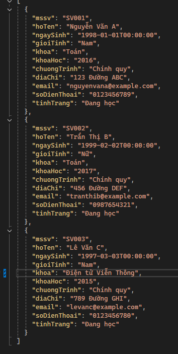
- Dữ liệu được lưu trữ hiển thị lên màn hình
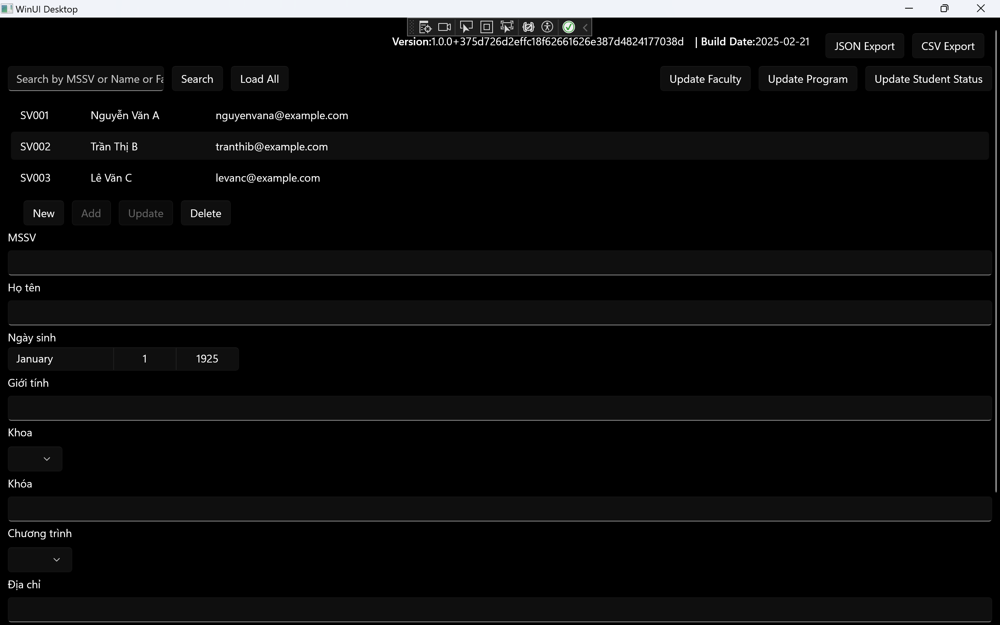

✅ **Cho phép đổi tên & thêm mới:**
- **Khoa (Faculty)**
	- Trước khi thêm khoa Môi trường
	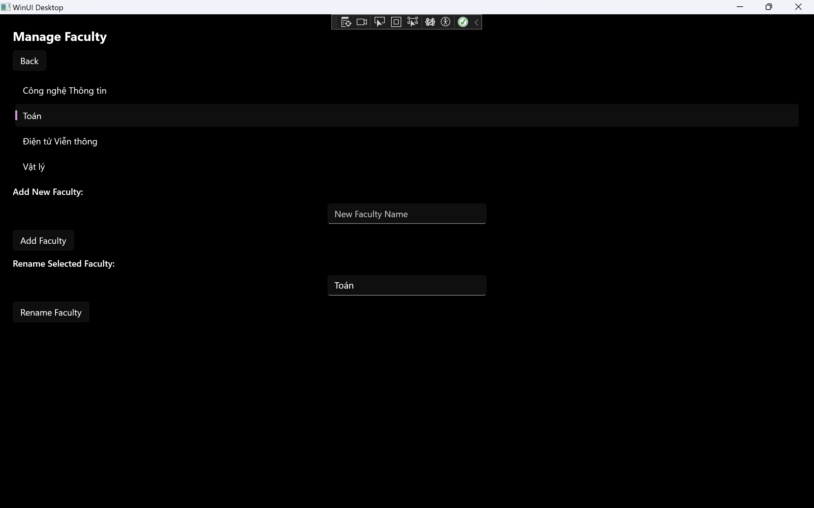
	- Sau khi thêm khoa Môi trường, list đã được cập nhật
	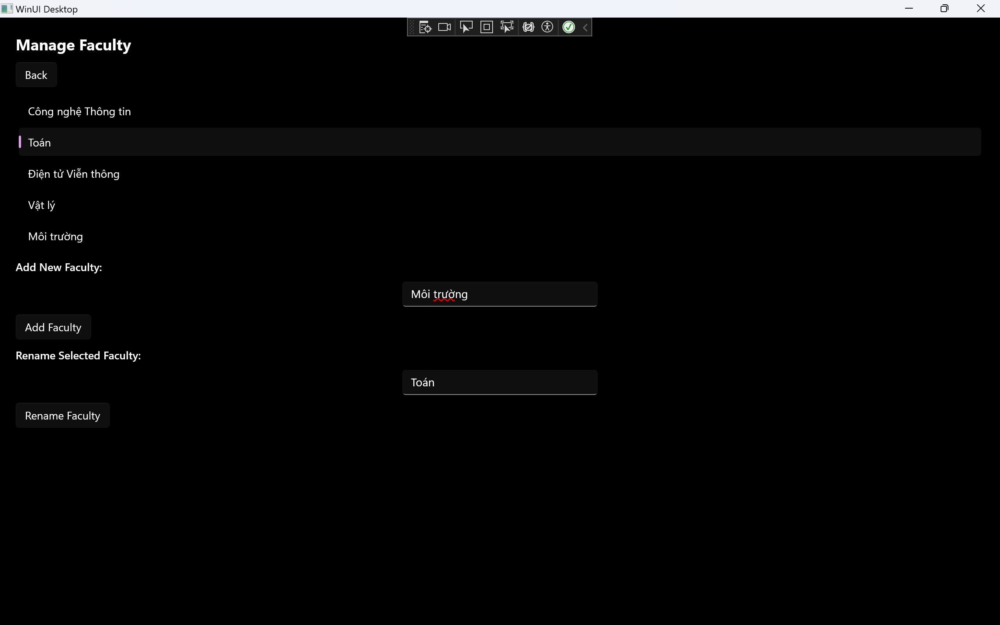
	- Sau khi đổi tên khoa Công nghệ thông tin thành CNTT
	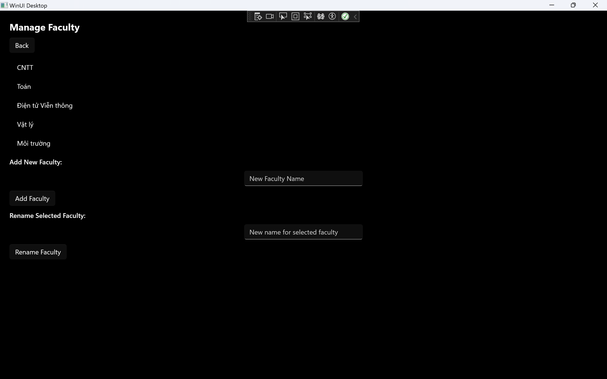
- **Tình trạng sinh viên (Student Status)**
	- Trước khi thêm `StudentStatus`
	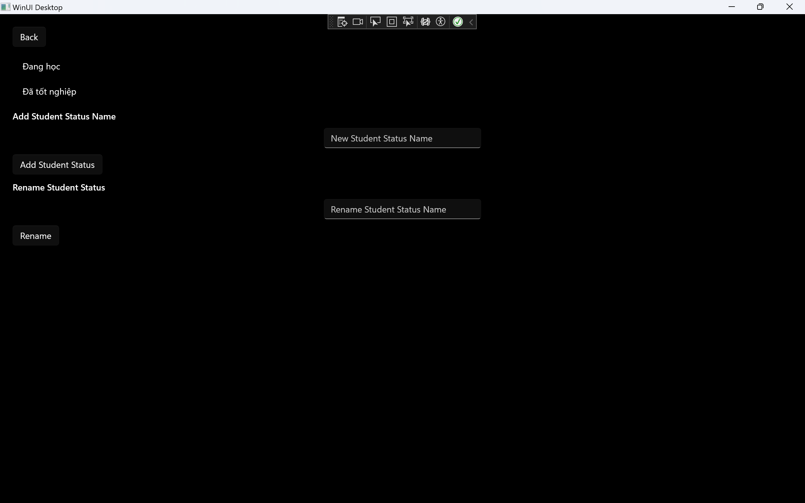
	- Sau khi thêm `StudentStatus` Du học
	
	- Sửa `StudentStatus` đang học thành `Active` 
	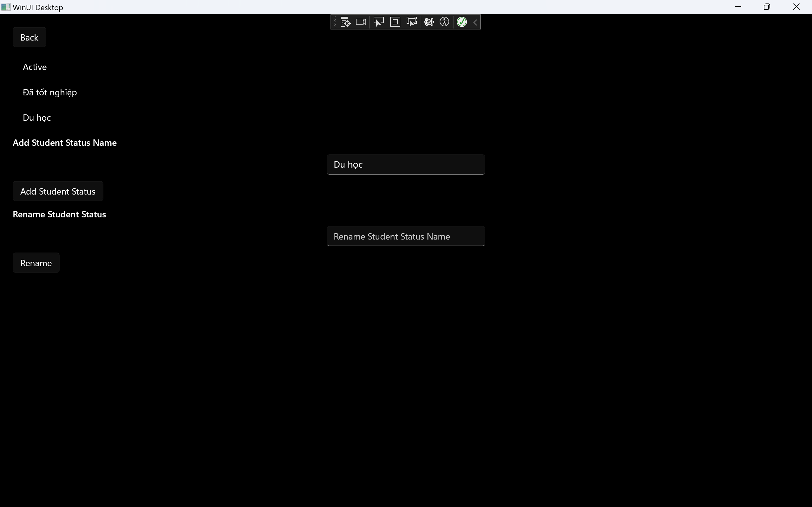
- **Chương trình đào tạo (Program)**
	-  Trước khi thêm chương trình đào tạo mới
	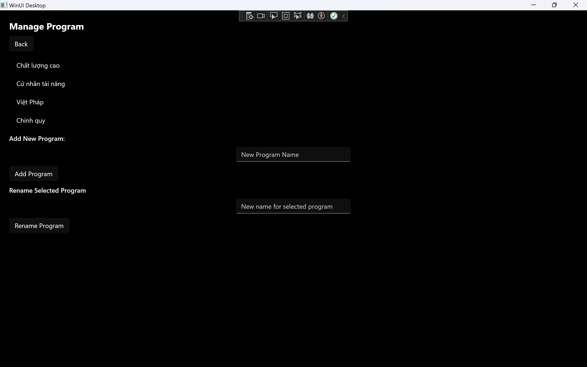
	- Sau khi thêm chương trình đào tạo từ xa
	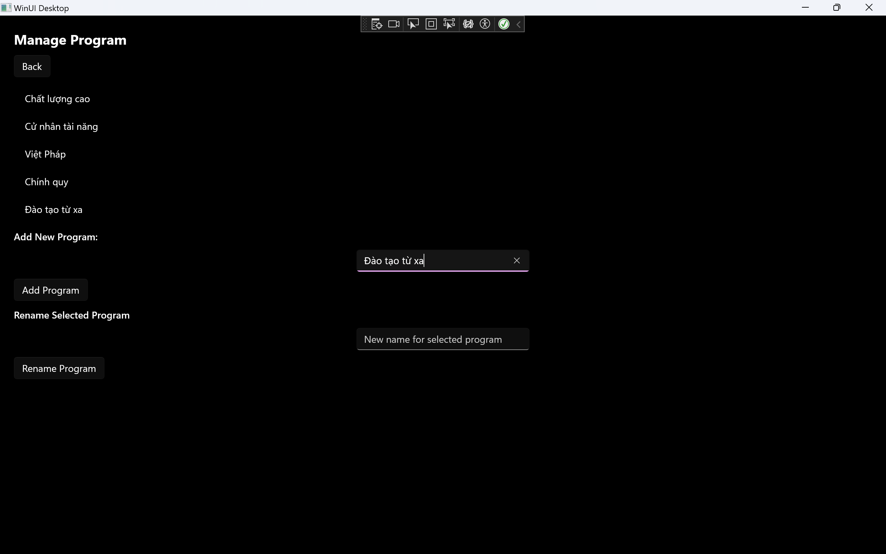
	- Đổi tên chương trình Đào tạo từ xa thành Đào tạo Online
	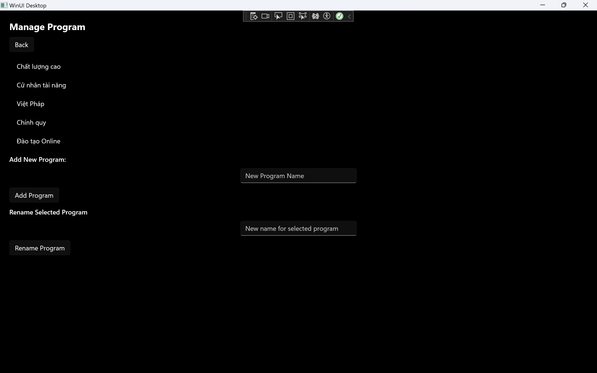

✅ **Thêm chức năng tìm kiếm:**
- Bộ dữ liệu gồm 3 sinh viên, được lưu trữ trong Data/students.json:
	- 2 sinh viên khoa Toán
	- 1 sinh viên khoa Điện tử Viễn Thông
- Tìm kiếm theo khoa Toán
	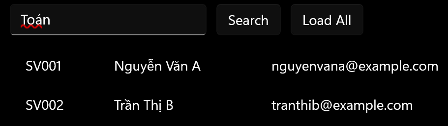
- Tìm kiếm theo khoa Toán + Nguyễn Văn A, lưu ý phải có dấu + trong Querry
	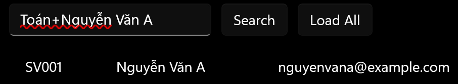

✅ **Hỗ trợ import/export dữ liệu:**
- Hỗ trợ Export Json và CSV, các nút Export ở góc trên bên phải màn hình
	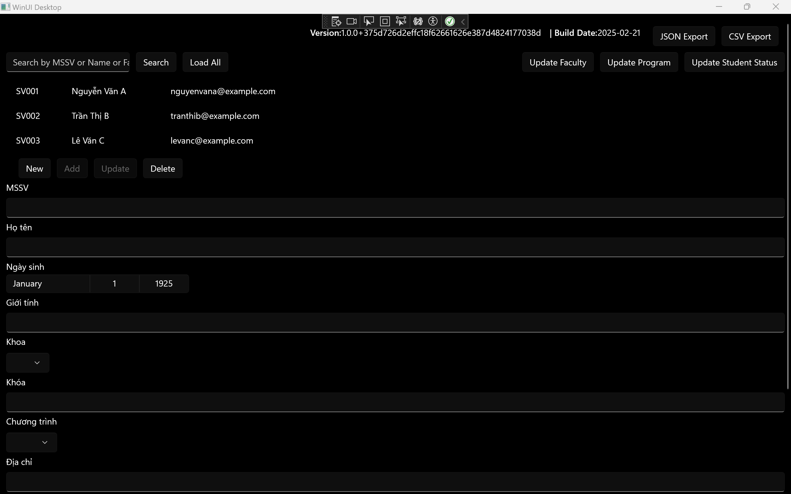
	- File được Export trong local, nơi lưu file được in ra trong file Log và trong màn hình output
	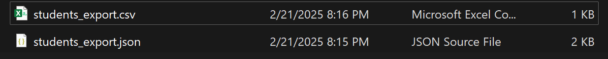

✅ **Thêm logging mechanism:**
- File log.txt được lưu trong thư mục local cùng với các file Export
	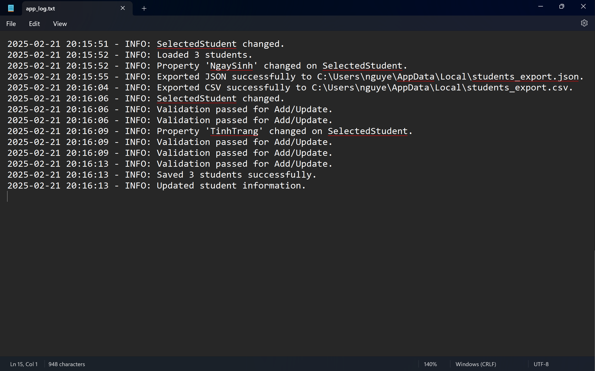
