✅ **Lưu trữ dữ liệu:**

- Bộ dữ liệu gồm 3 sinh viên, được lưu trữ trong Data/students.json:
  - 2 sinh viên khoa Toán
  - 1 sinh viên khoa Điện tử Viễn Thông
- `Students.json`
  
- Dữ liệu được lưu trữ hiển thị lên màn hình
  

✅ **Cho phép đổi tên & thêm mới:**

- **Khoa (Faculty)**
  - Trước khi thêm khoa Môi trường
    
  - Sau khi thêm khoa Môi trường, list đã được cập nhật
    
  - Sau khi đổi tên khoa Công nghệ thông tin thành CNTT
    
- **Tình trạng sinh viên (Student Status)**
  - Trước khi thêm `StudentStatus`
    
  - Sau khi thêm `StudentStatus` Du học
    
  - Sửa `StudentStatus` đang học thành `Active`
    
- **Chương trình đào tạo (Program)**
  - Trước khi thêm chương trình đào tạo mới
    
  - Sau khi thêm chương trình đào tạo từ xa
    
  - Đổi tên chương trình Đào tạo từ xa thành Đào tạo Online
    

✅ **Thêm chức năng tìm kiếm:**

- Bộ dữ liệu gồm 3 sinh viên, được lưu trữ trong Data/students.json:
  - 2 sinh viên khoa Toán
  - 1 sinh viên khoa Điện tử Viễn Thông
- Tìm kiếm theo khoa Toán
  
- Tìm kiếm theo khoa Toán + Nguyễn Văn A, lưu ý phải có dấu + trong Querry
  

✅ **Hỗ trợ import/export dữ liệu:**

- Hỗ trợ Export Json và CSV, các nút Export ở góc trên bên phải màn hình
  
  - File được Export trong local, nơi lưu file được in ra trong file Log và trong màn hình output
    

✅ **Thêm logging mechanism:**

- File log.txt được lưu trong thư mục local cùng với các file Export
  

✅ **Show veresion và ngày build ứng dụng:**

- Version và ngày Build được thể hiện ở trên cùng màn hình.
  

## EX03:

### A. Bổ sung Business logic

#### 1. MSSV phải là duy nhất

#### 1. MSSV phải là duy nhất

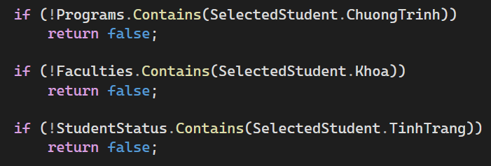

#### 2. Email phải thuộc một tên miền `@student.university.edu.vn`

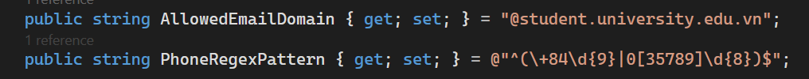
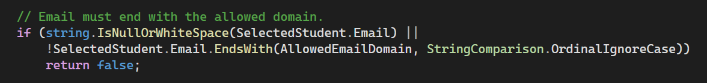

#### 3. Số điện thoại có định dạng VN `+84` hoặc `0[3|5|7|8|9]xxxxxxxx`

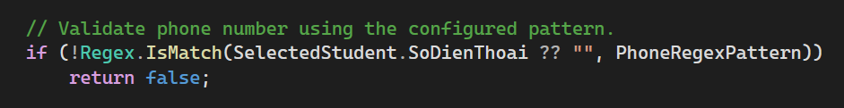

#### 4. Tình trạng sinh viên chỉ có thể thay đổi theo quy tắc:

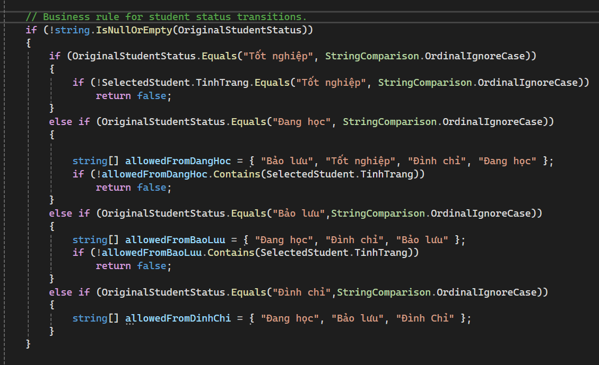

- "Đang học"`→`"Bảo lưu"`, `"Đình chỉ"`, `"Tốt nghiệp"`
- "Bảo lưu"`→`"Đang học"`, `"Đình chỉ"`
- "Đình chỉ"`→`"Bảo lưu"`, `"Đang học"`
- "Tốt nghiệp" -> "Tốt nghiệp", không thể đổi sang mode nào khác

### B. Unit testing:

- Báo cáo trong folder Reports.

## EX04:

### A. Bổ sung tính năng

#### 6. Chỉ được phép xóa sinh viên có creation date/time trong khoảng thời gian nhất định. Ví dụ: 30 phút (configurable)

- Có thể xóa sinh viên trong khoảng thời gian 30P kể từ lúc tạo/nạp data:
  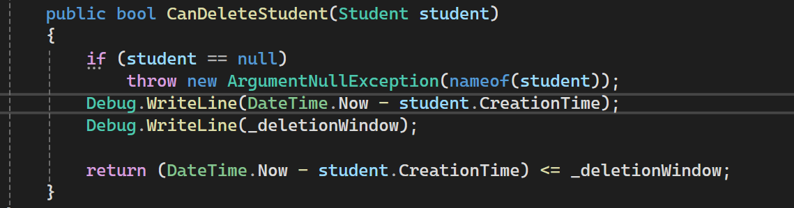

#### 7. Cho phép bật / tắt việc áp dụng các quy định

- Mặc định dạng email là @student.university.edu.vn
- Bật Business Rule thì không thể format email sai định dạng (Các nút Add và Update bị disabled)
  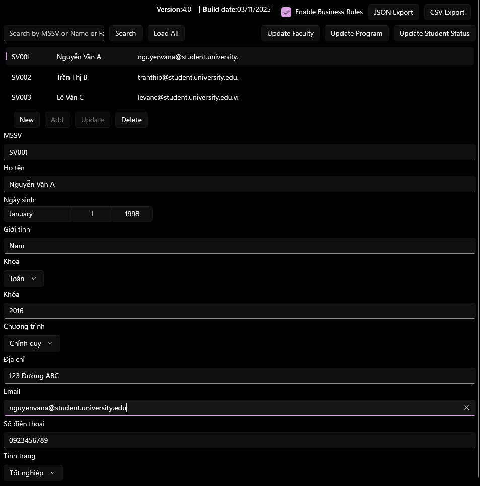
- Tắt Business Rule thì có thê format email sai định dạng (Các nút Add và Update được enabled)
  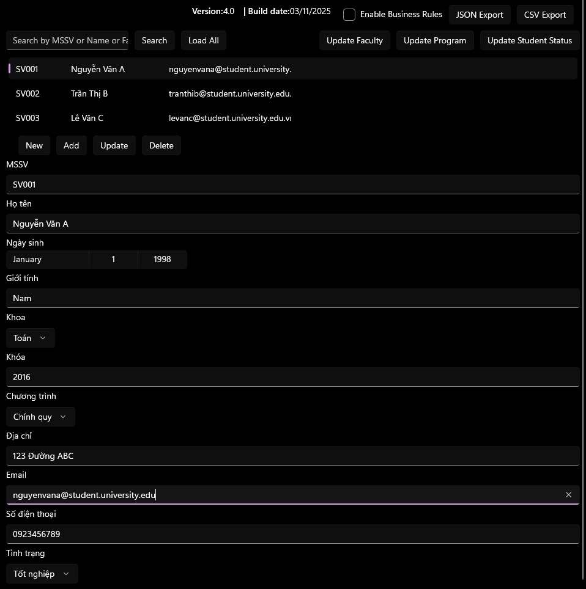

#### 8. Các màn hình cần hiện logo hoặc tên Trường (ít nhất một)

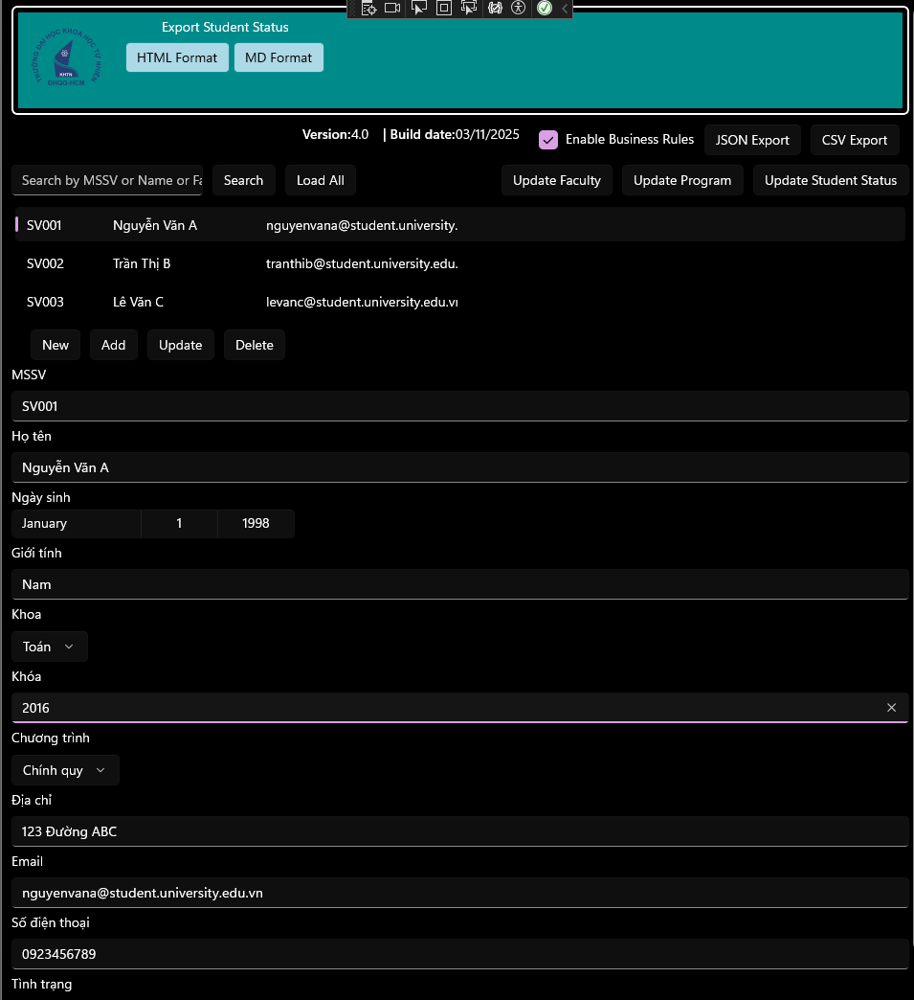

#### 9. Cho phép xóa khoa, xóa tình trạng sinh viên, xóa chương trình đào tạo nếu không có ràng buộc về dữ liệu

- Trước khi xóa khoa Điện tử viễn thông
  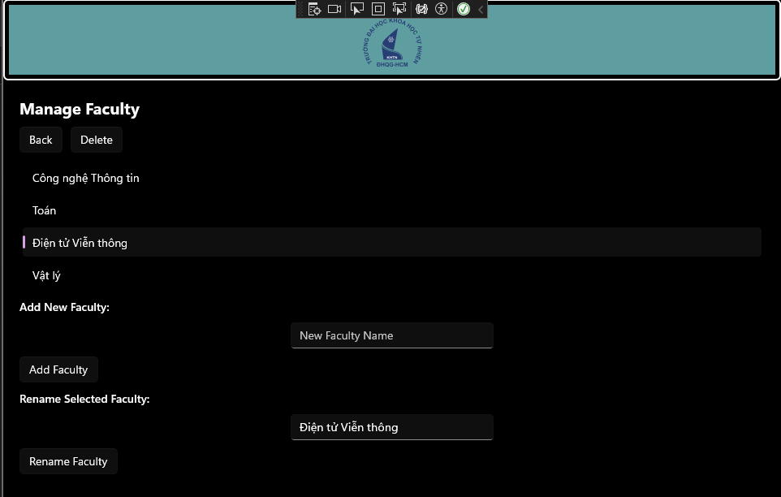
- Sau Khi xóa khoa Điện tử viễn thông
  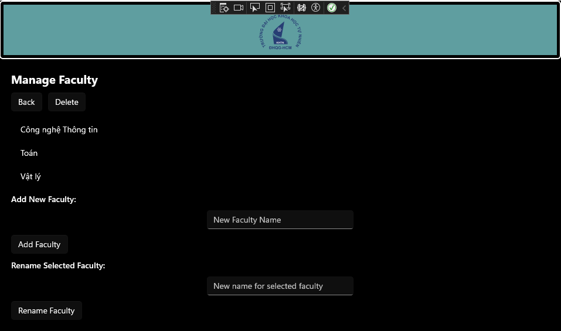
- Khoa toán không thể xóa do bộ dữ liệu các sinh viên hiện tại đang học khoa toán.
- Tương tự với chương trình và tình trạng sinh viên.

#### 10. Xuất giấy xác nhận tình trạng sinh viên ra **HTML/MD/PDF/DOCX** (ít nhất 2 định dạng)

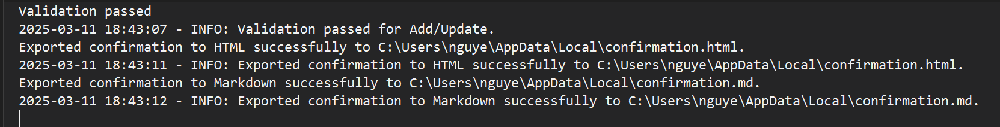
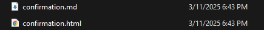

### B. Báo cáo Single Responsibility Principle và Don't Repeat Your Self

- Báo cáo trong folder Reports.
